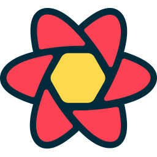

<h1 align="left">:wave: Hello there! I'm Shakib Al Furkan</h1>

<!-- there will be a banner  -->

I am a Web Developer passionate about creating innovative digital solutions. I
love to contribute to cutting-edge projects and explore emerging technologies. I
am dedicated to continuous learning and helping the tech community grow. I am
located in Bangladesh.

## 📫 Reach me out

 <!-- icons from :
 https://github.com/tandpfun/skill-icons?tab=readme-ov-file#icons-list
  -->

> Explore my [portfolio](demo) and join me on this exciting tech journey!

  
  
  
  
  
  

## 📈 Current Stats

  
  

## 💻 Tech Stack

> Tools, languages, and technologies that fuel my passion for coding!

#### Languages

<table>
  <tr>
    <td align="center" width="98">
        
       JavaScript
    </td>
    <td align="center" width="98">
        
       TypeScript
    </td>
  </tr>
</table>

#### Libraries and Frameworks

<table>
  <tr>
    <td align="center" width="98">
        
       React
    </td>
    <td align="center" width="98">
        
       NextJS
    </td>
    <td align="center" width="98">
        
       Redux
    </td>
    <td align="center" width="98">
        
       CSS
    </td>
    <td align="center" width="98">
        
       Tailwind
    </td>
    <td align="center" width="98">
        
       Bootstrap
    </td>
    <td align="center" width="98">
        
       Sass
    </td>
    <td align="center" width="98">
        
       HTML
    </td>
  </tr>

  <tr>
    <td align="center" width="98">
        
       T. Query
    </td>
    <td align="center" width="98">
        
       Firebase
    </td>
    <td align="center" width="98">
        
       Vite
    </td>
    <td align="center" width="98">
        
       GraphQL
    </td>
    <td align="center" width="98">
        
       Vitest
    </td>
    <td align="center" width="98">
        
       RTL
    </td>
    <td align="center" width="98">
        
       NodeJS
    </td>
    <td align="center" width="98">
        
       ExpressJS
    </td>
  </tr>

  <tr>    
    <td align="center" width="98">
        
       MongoDB
    </td>
    <td align="center" width="98">
        
       PostgreSQL
    </td>
    <td align="center" width="98">
        
       Prisma
    </td>
    <td align="center" width="98">
        
       RestAPI
    </td>
  </tr>
</table>

#### Tools

<table>
  <tr>
   <td align="center" width="98">
        
       Arch
    </td>
   <td align="center" width="98">
        
       VS Code
    </td>
   <td align="center" width="98">
        
       Postman
    </td>
   <td align="center" width="98">
        
       Figma
    </td>      
   <td align="center" width="98">
        
       Git
    </td>   
   <td align="center" width="98">
        
       Github
    </td>   
    <td align="center" width="98">
        
       Bash
    </td>
    <td align="center" width="98">
        
       Vercel
    </td>
  </tr>
</table>

## 👀 Current overview

  

- 👋 Currently working on web development and exploring innovative tech
  solutions
- 🌱 Currently learning Docker, Kubernetes, AWS, GSAP, Advance Animations and
  more
- 📚 Perpetual knowledge seeker, always staying ahead of tech trends
- 💡 Transforming complex challenges into elegant code
- 🚀 Actively expanding skill set across different development domains
- 🤝 Open to exciting opportunities and collaborative tech projects
- 🌟 Turning innovative ideas into reality, one line of code at a time
